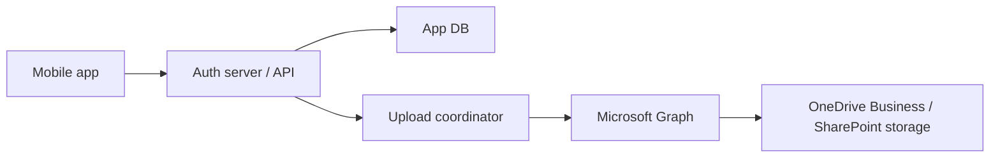

# MaruPhoto

MaruPhoto is a Google Photos-like application with these goals:

- mobile app automatically backs up photos and videos from the phone
- users sign in with Google through Firebase Auth, then call your auth server
- storage is backed by Microsoft 365 file storage
- the underlying OneDrive Business or SharePoint storage account is not disclosed to end users
- the auth server should not require large local storage for upload caching

## Recommended storage model

Do not model this as "each user signs in to their own OneDrive".

If the product requirement is to hide the Microsoft account from users, the storage layer should be app-managed:

- the mobile app authenticates with Firebase Auth, then presents a Firebase ID token to your backend
- your backend holds Microsoft credentials and talks to Microsoft Graph
- files are stored in a service-managed storage location
- users never receive Microsoft access tokens or see the Microsoft tenant/account

For this use case, there are two viable options:

1. Dedicated SharePoint/OneDrive-for-Business-backed storage owned by your tenant
2. SharePoint Embedded containers if you want a more app-native and less user-visible storage model

If you want the simplest first version, use a dedicated SharePoint site or document library and access it with application permissions. Avoid storing directly in a human user's personal OneDrive unless you are intentionally using a service account and accept the operational risk.

## Why not expose OneDrive directly

OneDrive Business is user-centric. Once users authenticate directly with Microsoft, they can discover the tenant context, consent scopes, and usually the storage identity. That conflicts with your objective.

The safer model is:

- Firebase issues the mobile user's identity token
- your auth server verifies the Firebase ID token and creates your internal user/session context
- your server maps each app user to an internal storage namespace
- your server uploads files to Microsoft Graph using app-only tokens

## High-level architecture

## Core backend responsibilities

- verify Firebase ID tokens and manage app sessions
- device registration and per-device backup state
- resumable upload orchestration
- photo deduplication by content hash
- metadata indexing for timeline, albums, and search
- storage abstraction so Microsoft Graph is replaceable later

## Suggested repository layout

- `auth-server/`: API server, auth logic, upload orchestration, storage adapter
- `mobile-app/`: iOS/Android or React Native app for auto backup and gallery UI
- `docs/`: architecture, sequence flows, security notes

## First build milestone

Build only these features first:

1. Google sign-in with Firebase Auth
2. device enrollment
3. background upload of new photos
4. resumable streaming upload through your backend to Microsoft-backed storage
5. gallery list from metadata stored in your database

Skip albums, AI search, sharing, edits, and live photos until the upload pipeline is stable.
