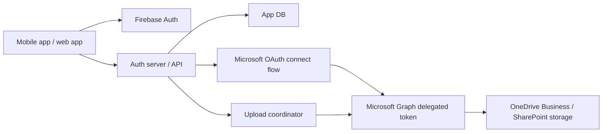

# MaruPhoto

MaruPhoto is a Google Photos-like application with these goals:

- mobile app automatically backs up photos and videos from the phone
- users sign in to the app with Google through Firebase Auth
- users connect Microsoft storage separately when they want OneDrive Business or SharePoint as the storage backend
- storage is backed by Microsoft 365 file storage
- the auth server should not require large local storage for upload caching

## Current model

The current repository uses two identity layers:

- Firebase Auth for app identity
- Microsoft OAuth for storage consent

That means:

- the app verifies users with Firebase through your auth server
- your auth server issues the app session
- the same app user can connect a Microsoft account separately
- your auth server stores the Microsoft refresh token securely
- uploads are sent through your backend to Microsoft Graph using delegated access for that connected Microsoft user

## Product tradeoff

This delegated-storage model is practical, but it is not fully hidden storage:

- users do not need Microsoft login to access the app itself
- users do need to connect Microsoft once when they want OneDrive Business or SharePoint storage
- storage access is limited to what that connected Microsoft user can access

If you need storage to be completely app-managed and opaque to users, use an app-owned SharePoint site, SharePoint Embedded, or another service-managed storage layer instead.

## High-level architecture

## Core backend responsibilities

- verify Firebase ID tokens and manage app sessions
- enforce allowed-user policy for Firebase sign-in
- manage Microsoft OAuth connect and callback flow
- store encrypted Microsoft refresh tokens per app user
- device registration and per-device backup state
- resumable upload orchestration
- photo deduplication by content hash
- metadata indexing for timeline, albums, and search
- stream uploads without large local file cache

## Suggested repository layout

- `auth-server/`: API server, auth logic, upload orchestration, storage adapter
- `mobile-app/`: iOS/Android or React Native app for auto backup and gallery UI
- `docs/`: architecture, sequence flows, security notes
- `test-frontend/`: minimal endpoint tester
- `test-app-mock/`: fuller product-style mock web app

## First build milestone

Build only these features first:

1. Google sign-in with Firebase Auth
2. backend app session exchange and device enrollment
3. Microsoft storage connect flow
4. background upload of new photos
5. resumable streaming upload through your backend to Microsoft-backed storage
6. gallery list from metadata stored in your database

Skip albums, AI search, sharing, edits, and live photos until the upload pipeline is stable.
