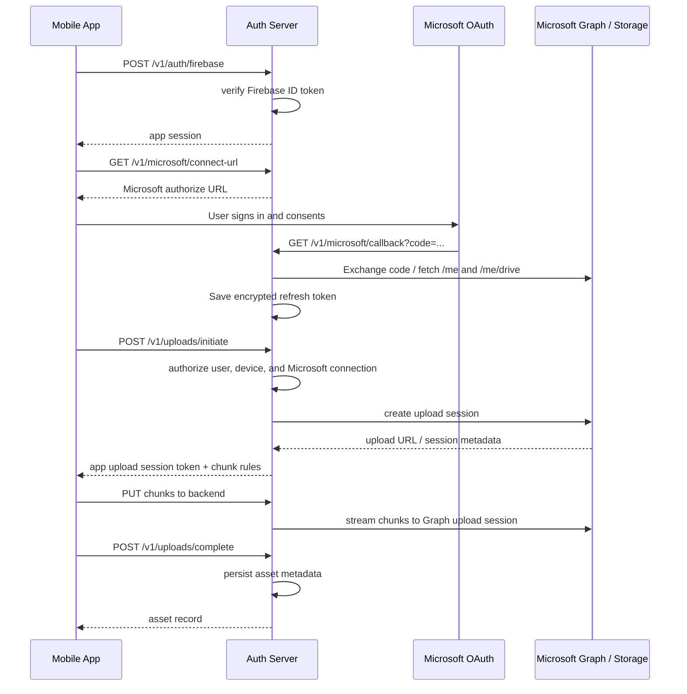

# Architecture

## Objective

Use Microsoft 365 storage as the backend for a Google Photos-like app while keeping app identity separate from storage identity and avoiding large auth-server file cache.

## Recommended design

### Identity boundary

- users authenticate with Google through Firebase Auth
- mobile app sends the Firebase ID token to your auth server
- auth server verifies the Firebase ID token with Firebase Admin SDK
- auth server enforces its own allowlist policy before issuing an app session
- mobile app stores only your app session and never any app secret

### Storage consent boundary

- user clicks `Connect Microsoft` when they want to use OneDrive Business or SharePoint storage
- auth server runs Microsoft OAuth authorization code flow
- auth server stores an encrypted Microsoft refresh token per app user
- auth server refreshes delegated Graph access tokens server-side
- the frontend never receives the Microsoft refresh token

### Storage boundary

- backend uploads files to Microsoft Graph with delegated user permissions
- each app user gets a logical namespace such as `users/{userId}/yyyy/mm/filename`
- backend stores the mapping from app user to storage path and drive item ids
- backend can target either the connected user's own drive or a specific SharePoint drive if that user has access

### Data boundary

Store photo metadata in your own database, not only in Microsoft storage:

- `assets`
- `asset_variants`
- `device_uploads`
- `albums`
- `users`
- `devices`
- `microsoft_accounts`

This prevents gallery listing from depending on expensive drive traversal calls.

## Storage options

### Option A: Connected user's OneDrive Business

Best match for the current repository implementation.

Pattern:

- user signs in to the app with Firebase
- user connects a Microsoft account for storage
- backend uploads into that connected user's drive using delegated Graph access
- app keeps its own internal user model separate from Microsoft identity

Pros:

- simple
- mature Graph APIs
- fits an existing OneDrive Business / Microsoft 365 subscription
- each user's storage stays under that user's Microsoft account

Cons:

- user must explicitly connect Microsoft
- storage identity is not fully hidden from the user
- access is limited to what that Microsoft user can access

### Option B: Shared SharePoint library with delegated access

Possible when all connected Microsoft users have access to the same SharePoint library.

Pattern:

- keep the same Firebase app identity model
- use Microsoft delegated consent
- upload to a configured SharePoint site or drive rather than `/me/drive`

Pros:

- keeps storage in a central library
- useful for team or tenant-shared content patterns

Cons:

- the Microsoft user still needs access to that site or drive
- delegated permissions may require broader scopes such as `Files.ReadWrite.All` or `Sites.ReadWrite.All`

### Option C: App-managed storage

Use only if the product requirement is to hide Microsoft storage identity from users completely.

Pattern:

- backend uses app-only Graph access to a dedicated SharePoint site, SharePoint Embedded, or another service-managed store
- users never connect Microsoft directly

Pros:

- stronger product boundary
- cleaner long-term abstraction for a consumer-style photo app

Cons:

- different from the current repo implementation
- requires a different consent and storage model

## Threat model

### Things the mobile app must never have

- Microsoft client secret
- Microsoft refresh token
- SharePoint site admin capability
- broad storage capability URLs beyond short-lived upload sessions

### Things the server must enforce

- user can access only assets owned by that user
- connected Microsoft account belongs to the authenticated app user record
- upload sessions are short-lived and bound to one asset
- content hash is checked after upload
- EXIF and MIME type are validated server-side
- rate limiting per device and per user
- allowed Firebase user policy is checked before issuing app sessions

## Upload flow

## Why keep Firebase and Microsoft separate

This architecture separates:

- app identity and product access, handled by Firebase plus your backend policy
- storage consent and storage reachability, handled by Microsoft OAuth

That makes it possible to keep your own user model while still using Microsoft 365 as the storage backend.

## Why proxy uploads through backend

If the app uploads directly to a Microsoft preauthenticated upload URL, the URL itself becomes a temporary storage capability. That may still be acceptable later, but the current implementation proxies chunks through the backend because it gives:

- simpler audit and abuse control
- easier content hashing and deduplication
- cleaner ownership checks between app user, device, and Microsoft account
- no need for large auth-server disk cache if chunks are streamed through immediately

## Minimal-cache upload strategy

The auth server does not need large storage.

Recommended behavior:

- mobile app uploads fixed-size chunks
- auth server validates the session and byte range
- auth server ensures the user has a linked Microsoft account before upload start
- auth server forwards the chunk stream directly to the Graph upload session
- auth server stores only small metadata in Redis or PostgreSQL
- if the upload resumes, auth server reads the last confirmed offset from Graph or local session state

Avoid:

- writing full photo files to local disk before forwarding
- using the auth server as a long-lived blob cache

## Database sketch

### users

- `id`
- `firebase_uid`
- `email`
- `provider`
- `created_at`

### devices

- `id`
- `user_id`
- `platform`
- `app_version`
- `last_backup_cursor`

### assets

- `id`
- `user_id`
- `storage_provider`
- `storage_path`
- `drive_item_id`
- `sha256`
- `mime_type`
- `capture_time`
- `width`
- `height`
- `duration_ms`
- `bytes`
- `status`

### upload_sessions

- `id`
- `user_id`
- `device_id`
- `asset_id`
- `provider_session_id`
- `expected_bytes`
- `received_bytes`
- `expires_at`
- `status`

### microsoft_accounts

- `id`
- `user_id`
- `microsoft_user_id`
- `email`
- `display_name`
- `encrypted_refresh_token`
- `scope`
- `token_expires_at`
- `drive_id`
- `drive_type`

## API shape

See `auth-server/openapi.yaml`.
