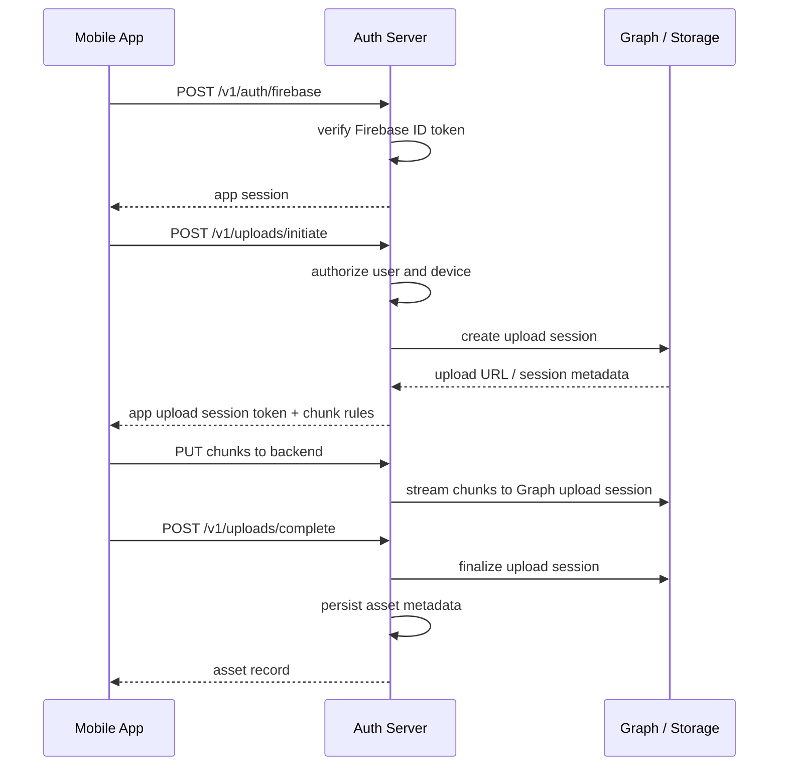

# Architecture

## Objective

Use Microsoft 365 storage as the backend while preventing end users from interacting with or learning the underlying storage account.

## Recommended design

### Identity boundary

- users authenticate with Google through Firebase Auth
- mobile app sends the Firebase ID token to your auth server
- auth server verifies the Firebase ID token with Firebase Admin SDK
- mobile app stores only your app session and never any Microsoft credential
- Microsoft Entra credentials remain only on the server

### Storage boundary

- backend uploads files to Microsoft Graph with application permissions
- each app user gets a logical namespace such as `users/{userId}/yyyy/mm/filename`
- backend stores the mapping from app user to storage path and drive item ids
- backend uses your Microsoft 365 tenant storage, ideally a dedicated SharePoint site or document library

### Data boundary

Store photo metadata in your own database, not only in Microsoft storage:

- `assets`
- `asset_variants`
- `device_uploads`
- `albums`
- `users`
- `devices`

This prevents gallery listing from depending on expensive drive traversal calls.

## Storage options

### Option A: SharePoint document library backed by Graph

Best for a fast MVP.

Pattern:

- create one dedicated SharePoint site or document library for the app
- grant the backend app write access only to that site
- store each tenant or user under isolated folders

Pros:

- simple
- mature Graph APIs
- works with app-only auth
- fits your existing OneDrive Business / Microsoft 365 subscription

Cons:

- operationally this is still "your Microsoft 365 storage"
- not as cleanly app-native as SharePoint Embedded

### Option B: SharePoint Embedded

Best when the product must feel fully app-owned and isolated.

Pattern:

- the app manages file storage containers
- content is API-only by default
- your application provides the entire UX

Pros:

- aligns well with "hidden storage account" goal
- cleaner long-term isolation model

Cons:

- more setup complexity
- pay-as-you-go billing model
- not the simplest way to consume an existing OneDrive Business subscription

### Option C: Service account OneDrive

Possible, but not preferred.

Pattern:

- buy or assign one licensed Microsoft 365 user account
- backend uploads all content into that account's OneDrive
- user folders are separated logically by path

Pros:

- very simple to understand
- may work for very small MVPs

Cons:

- weak operational boundary
- harder to scale and govern
- ties app storage to a user-style drive
- worse long-term fit than a dedicated SharePoint library

## Threat model

### Things the mobile app must never have

- Microsoft client secret
- Graph application token
- SharePoint site admin capability
- raw storage root ids unless strictly necessary

### Things the server must enforce

- user can access only assets owned by that user
- upload sessions are short-lived and bound to one asset
- content hash is checked after upload
- EXIF and MIME type are validated server-side
- rate limiting per device and per user

## Upload flow

## Why proxy uploads through backend

If the app uploads directly to a Microsoft preauthenticated upload URL, the URL itself becomes a storage capability. That may be acceptable for a tightly controlled short-lived session, but it weakens your "hide the account" goal and complicates audit and abuse controls.

For the first version, proxy the upload through your backend without persisting large temporary files:

- simpler security model
- easier malware scanning and quota enforcement
- easier content hashing and duplicate detection
- no need for large auth-server disk cache if chunks are streamed through immediately

Later, if bandwidth cost becomes a problem, you can switch to server-created Graph upload sessions and return short-lived opaque upload tickets that the mobile app exchanges through a controlled upload gateway.

## Minimal-cache upload strategy

The auth server does not need large storage.

Recommended behavior:

- mobile app uploads fixed-size chunks
- auth server validates the session and byte range
- auth server forwards the chunk stream directly to the Graph upload session
- auth server stores only small metadata in Redis or PostgreSQL
- if the upload resumes, auth server reads the last confirmed offset from Graph or local session state

Avoid:

- writing full photo files to local disk before forwarding
- using the auth server as a long-lived blob cache

## Database sketch

### users

- `id`
- `firebase_uid`
- `email`
- `provider`
- `created_at`

### devices

- `id`
- `user_id`
- `platform`
- `app_version`
- `last_backup_cursor`

### assets

- `id`
- `user_id`
- `storage_provider`
- `storage_path`
- `drive_item_id`
- `sha256`
- `mime_type`
- `capture_time`
- `width`
- `height`
- `duration_ms`
- `bytes`
- `status`

### upload_sessions

- `id`
- `user_id`
- `device_id`
- `asset_id`
- `provider_session_id`
- `expected_bytes`
- `received_bytes`
- `expires_at`
- `status`

## API shape

See `auth-server/openapi.yaml`.
